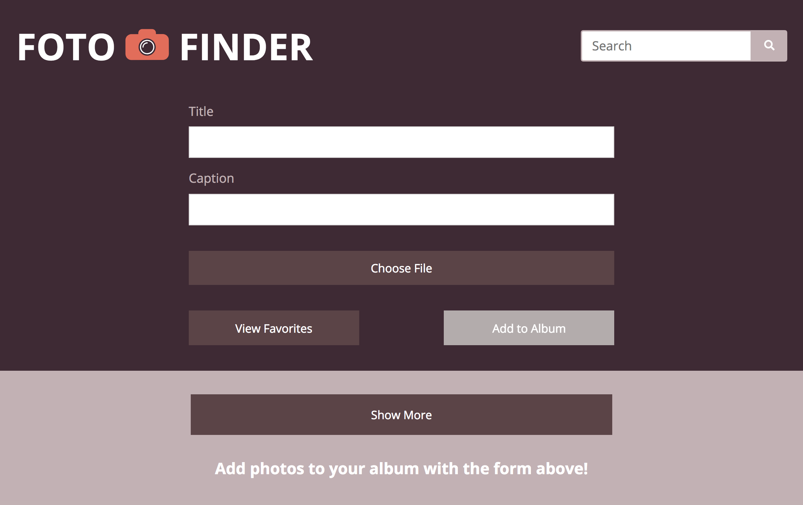

# Foto Finder
Assignment - MOD1 Final Project

## Summary
This web application allows users to upload photos and store them in the Foto Finder Album with custom titles and captions.  
Users can also:  
* Delete photos they no longer want in the album
* Search through their photos' titles and captions to find specific photos
* Favorite specific photos
* View only their favorite photos or view all photos in the album  

## Built With
* HTML
* CSS
* JS

## Final Site

